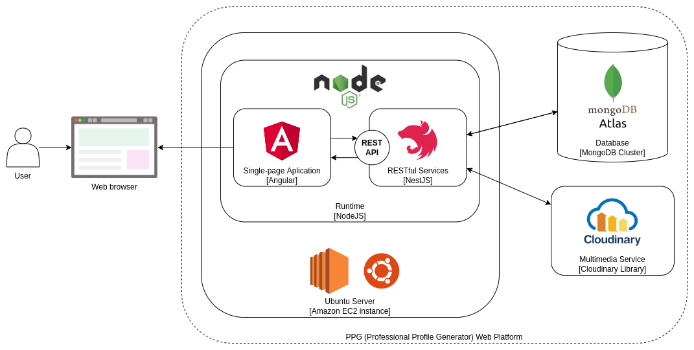
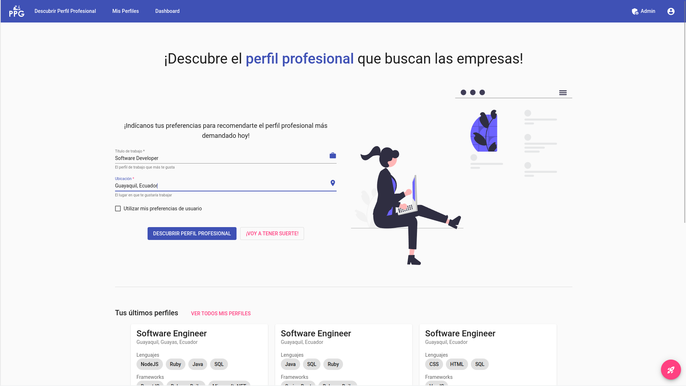
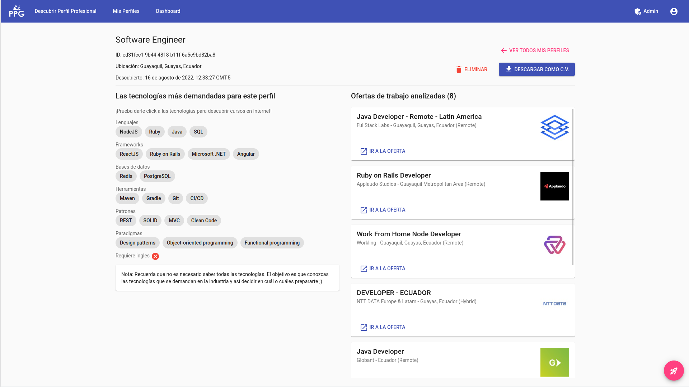
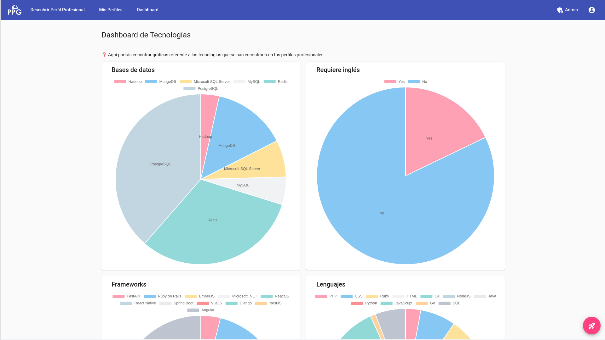
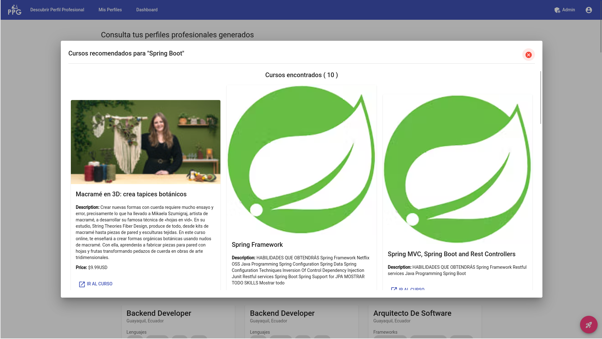
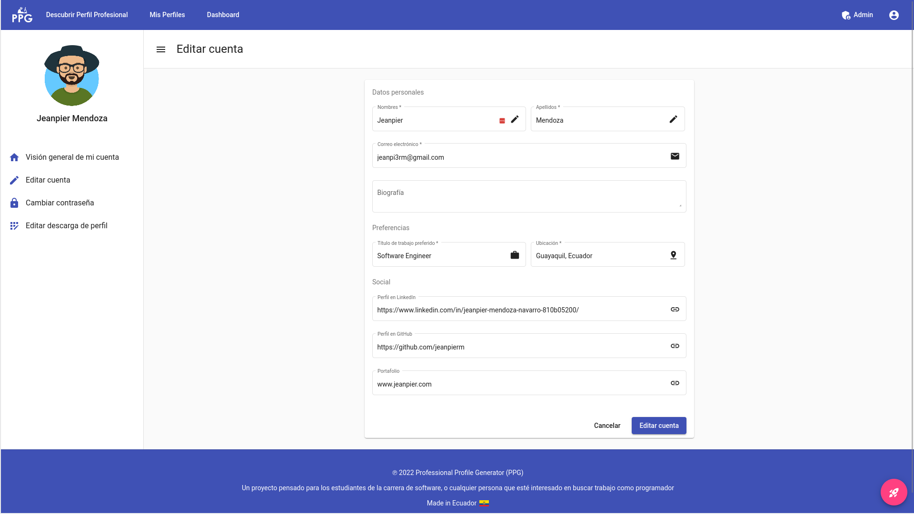
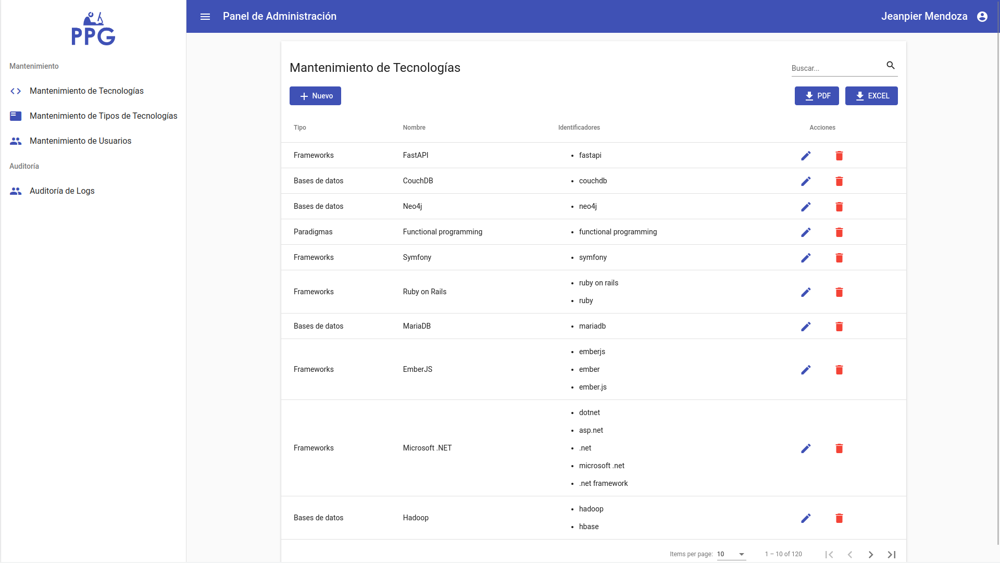
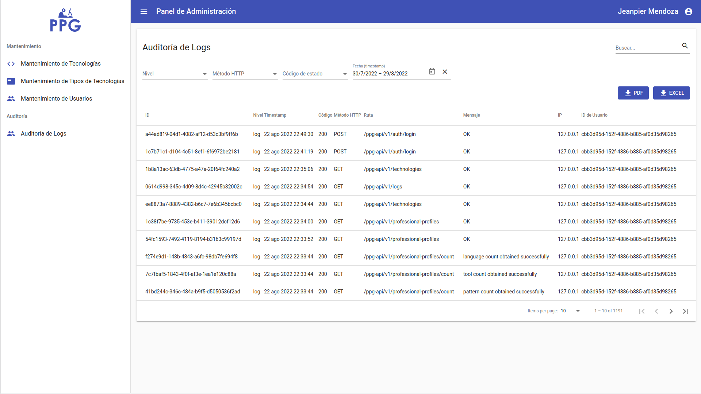

# Professional Profile Generator (PPG) Web Platform

<p align="center">
 
 
</p>

## Description

A web platform that allows you to discover the most demanded technologies in your city in real time using web scraping. Developed in team with [@EmilyLino](https://github.com/EmilyLino).

## Technologies

Server:

- NestJS v9
- TypeScript + ESLint
- Puppeteer v15
- JWT
- ESLint
- Mongoose/MongoDB
- Swagger

Client:

- Angular v14
- TypeScript + ESLint
- Angular Material
- Reactive forms, HttpClient, RxJS, ng2-charts, and others technologies of the Angular ecosystem

## Server repository

<https://github.com/jeanpierm/ppg-server>

## Architecture

### General



### API (Server) Components Diagram [C4 Model - Level 3]


### SPA (Client) Components Diagram [C4 Model - Level 3]


## Installation

```bash
$ npm install
```

## Running the app

```bash
# development
$ npm run start
```

## Screenshots

### Home


### Discover professional profile

It allows discovering the professional profile with the most demanded technologies according to the location and preferred job title in real time.



### View professional profile



### Dashboard of the technologies found



### Discover technology courses



### Edit account



### Platform maintenance (admin panel)



### Logs (admin panel)


